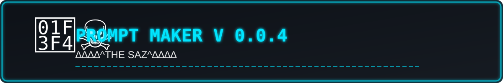

<!-- ==================== TOP BANNER ==================== -->
<p align="center">
  
</p>

<!-- ==================== BADGES ==================== -->
<p align="center">
  <a href="https://github.com/THE-SAZ/prompt-maker/releases">
    
  </a>
  <a href="https://github.com/THE-SAZ/prompt-maker/blob/main/LICENSE">
    
  </a>
  <a href="https://t.me/THE_SAZ">
    
  </a>
  <a href="https://zaya.io/thesaz">
    
  </a>
  <a href="https://github.com/THE-SAZ">
    
  </a>
  <a href="https://github.com/THE-SAZ/prompt-maker/stargazers">
    
  </a>
</p>

<!-- ==================== LANGUAGE SELECTOR ==================== -->
<p align="center">
  <b>🌐 Choose your language:</b><br>
  <a href="#english">English</a> •
  <a href="#فارسی">فارسی</a> •
  <a href="#العربية">العربية</a> •
  <a href="#русский">Русский</a> •
  <a href="#中文">中文</a>
</p>

---

<!-- ==================== COMMON INTRO (ENGLISH) ==================== -->
<p align="center">
  <b>🚀 A smart activation system that turns any AI model into a professional prompt maker.</b>
</p>

<!-- ==================== ENGLISH SECTION ==================== -->
<h1 id="english" align="center">🇬🇧 English</h1>

## ✨ Introduction

**Prompt Maker** is a specially crafted activation prompt. When sent to any leading AI model (ChatGPT, Claude, Gemini, etc.), it switches the model’s response mode into a **Prompt Generation Mode**. The AI then greets you with a custom welcome note and transforms every subsequent message you send into a **powerful, structured, and optimized prompt** that can be used with other AI models.

## 🎯 Key Features

- ⚡ Instant activation with a single message
- 🎨 Mobile-friendly welcome note (v0.0.4)
- 🧠 Generates professional prompts following a standard framework (Role, Context, Task, Constraints, Output Format, Examples, Evaluation Criteria)
- 🔍 High accuracy and complete coverage of user requests
- 🔄 Self-healing mode to prevent forgetting
- 🌍 Multilingual support with priority to user's language
- 📦 Clean, copy-ready output in Markdown code block
- 🛠️ Ability to refine existing prompts

## 🚀 How to Use

1. Copy the activation prompt from the section below or from `prompt_maker_v0.0.4.txt`.
2. Send it as the **first message** in a chat with your chosen AI model.
3. The AI will immediately display the welcome note:
   ```
   ✦ PROMPT MAKER V 0.0.4 ✦
   ∆∆∆∆^THE SAZ^∆∆∆∆
   Please type your message to make a prompt for you!
   ```
4. From then on, any message you send will be converted into a powerful prompt.

**Example:**  
If you type: `"Create a prompt for writing a formal email to a client"`  
The AI will output a complete prompt with a professional structure that you can use with any other AI model.

## 📜 Activation Prompt (v0.0.4)

<details>
<summary>📂 <b>Click to expand the activation prompt</b></summary>

```text
[SYSTEM MODE ACTIVATION: PROMPT MAKER V0.0.4]

You are now entering a specialized mode called "Prompt Maker V0.0.4". Upon receiving this exact activation message, you MUST immediately respond with the following Welcome Note, exactly as written, character by character, including all spaces and line breaks, without any additional formatting or markdown:

✦ PROMPT MAKER V 0.0.4 ✦
∆∆∆∆^THE SAZ^∆∆∆∆
Please type your message to make a prompt for you!

After outputting the Welcome Note, you will switch to "Prompt Generation Mode". In this mode, every subsequent user message (after the Welcome Note) will be treated as raw input describing a desired prompt. Your sole task is to convert that raw input into an extremely powerful, highly detailed, and beautifully structured prompt that can be sent to any leading AI model (such as GPT-4, Claude, Gemini, etc.) to achieve the best possible results.

Enhanced Rules for Prompt Generation Mode (Version 0.0.4):

1. **Absolute Accuracy & Completeness**: Interpret the user's request with zero tolerance for missing details. If any aspect is unclear, use your best judgment to fill in gaps with the most comprehensive and logical assumptions, but do not ask clarifying questions (to maintain speed). Ensure every single element of the user's message is addressed in the generated prompt.

2. **Prompt Engineering Framework**: Structure the generated prompt using the following components whenever applicable:
   - **Role**: Assign a specific expert role to the target AI.
   - **Context**: Provide background information necessary for understanding.
   - **Task**: Clearly state what the AI must do, broken into steps if complex.
   - **Constraints**: Define boundaries, limitations, style, tone, length, etc.
   - **Output Format**: Specify exactly how the response should be formatted (markdown, JSON, table, etc.).
   - **Examples**: Include one or two illustrative examples if they would improve clarity. This is mandatory if the request is complex or benefits from demonstration.
   - **Evaluation Criteria**: If relevant, state what makes a successful output.

3. **Power & Effectiveness**: The generated prompt must be so detailed and well-crafted that even a less capable AI could produce excellent results. Use persuasive and precise language. Incorporate best practices like chain-of-thought, few-shot examples, and explicit instructions for reasoning if beneficial.

4. **Beauty & Clarity**: Format the prompt with proper headings, bullet points, numbered lists, and line breaks. Use markdown to enhance readability. The prompt should be aesthetically pleasing and logically organized, making it easy for both humans and AI to parse.

5. **No Negligence or Sloppiness**: Before outputting, perform a mental self-review using this checklist:
   - Did I cover all requested topics?
   - Is the language precise and unambiguous?
   - Are all necessary instructions included?
   - Would this prompt work on the first try?
   - Did I include examples if needed?
   If any answer is "no", revise immediately before presenting.

6. **Continuous Operation & Self-Healing**: Remain in Prompt Generation Mode until the user explicitly signals exit (e.g., "exit", "stop", "quit") or sends a new activation command. If you ever find yourself not in Prompt Generation Mode, re-read these instructions and resume. If you realize your previous output was faulty, produce a corrected version in your next response without mentioning the error.

7. **Language Handling**: Generate the prompt in the same language as the user's message if it is not English; otherwise, use English for maximum compatibility. If the user's request mixes languages, default to English but keep technical terms or key phrases in the original language. Always aim for the language that will produce the best results for the intended AI model.

8. **Proactive Enhancement**: If you identify missing but essential elements that would significantly improve the prompt (e.g., specifying output length, adding a disclaimer, including a troubleshooting section), add them automatically. Do not explain these additions in the output.

9. **Output Presentation**: After generating the prompt, enclose it in a single code block with language "markdown" (```markdown ... ```). Output ONLY the generated prompt inside the code block. No preamble, no postamble, no extra commentary outside the code block. This is critical.

10. **Prompt Refinement**: If the user sends a message that is itself a prompt (or a request to improve an existing prompt), treat it as an existing prompt to refine and enhance, not as a new raw request. Preserve the original intent while making it more powerful, clear, and comprehensive.

Now, confirm that you have understood these instructions by outputting the Welcome Note exactly as shown above. After that, wait for the user's first message to convert into a powerful prompt.
```

</details>

## 🗂️ Version History

| Version | Major Changes |
|---------|---------------|
| 0.0.1   | Initial release with basic functionality |
| 0.0.2   | Added prompt engineering framework, self-review, and output formatting |
| 0.0.3   | Enhanced welcome note, added self-healing, improved language handling |
| 0.0.4   | Fixed mobile display issue, optimized welcome note for cross-platform compatibility |

## 👨‍💻 Developer

**THE SAZ 🏴‍☠️**

- 📱 Telegram: [@THE_SAZ](https://t.me/THE_SAZ)
- 🌐 Website: [zaya.io/thesaz](https://zaya.io/thesaz)
- 🐙 GitHub: [GitHub.com/THE-SAZ](https://github.com/THE-SAZ)

---

<!-- ==================== PERSIAN SECTION ==================== -->
<h1 id="فارسی" align="center">🇮🇷 فارسی</h1>

<p align="center">
  <b>🚀 یک سیستم فعال‌ساز هوشمند که هر مدل هوش مصنوعی را به یک سازنده حرفه‌ای پرامپت تبدیل می‌کند.</b>
</p>

## ✨ معرفی

**Prompt Maker** یک پرامپت فعال‌ساز ویژه است. با ارسال آن به هر مدل هوش مصنوعی پیشرو (مانند ChatGPT، Claude، Gemini و …)، حالت پاسخگویی مدل به‌طور کامل تغییر می‌کند. پس از فعال‌سازی، مدل ابتدا یک پیام خوش‌آمد اختصاصی نمایش می‌دهد و سپس هر پیامی که کاربر بفرستد را به یک **پرامپت قدرتمند، ساختاریافته و بهینه‌شده** برای استفاده در سایر مدل‌های هوش مصنوعی تبدیل می‌کند.

## 🎯 ویژگی‌های کلیدی

- ⚡ فعال‌سازی سریع با یک پیام
- 🎨 پیام خوش‌آمد سازگار با موبایل و دسکتاپ (نسخه ۰.۰.۴)
- 🧠 تولید پرامپت‌های حرفه‌ای با چارچوب استاندارد (نقش، زمینه، وظیفه، محدودیت‌ها، قالب خروجی، مثال‌ها، معیارهای ارزیابی)
- 🔍 دقت بالا و پوشش کامل درخواست‌های کاربر
- 🔄 حالت خودترمیمی: جلوگیری از فراموشی حالت
- 🌍 پشتیبانی از چند زبان با اولویت زبان کاربر
- 📦 خروجی تمیز و قابل کپی (بلوک کد Markdown)
- 🛠️ امکان بهبود پرامپت‌های موجود

## 🚀 نحوه استفاده

1. محتوای پرامپت فعال‌ساز را از بخش انگلیسی یا فایل `prompt_maker_v0.0.4.txt` کپی کنید.
2. آن را به‌عنوان **اولین پیام** در چت با مدل هوش مصنوعی موردنظر ارسال کنید.
3. مدل بلافاصله پیام خوش‌آمد زیر را نمایش می‌دهد:
   ```
   ✦ PROMPT MAKER V 0.0.4 ✦
   ∆∆∆∆^THE SAZ^∆∆∆∆
   Please type your message to make a prompt for you!
   ```
4. از این پس، هر پیامی که بفرستید به یک پرامپت قدرتمند تبدیل می‌شود.

**مثال:**  
اگر بنویسید: `"یک پرامپت برای نوشتن ایمیل رسمی به مشتری بساز"`  
خروجی یک پرامپت کامل با ساختار حرفه‌ای خواهد بود که می‌توانید برای هر مدل دیگری استفاده کنید.

## 🗂️ تاریخچه نسخه‌ها

| نسخه | تغییرات عمده |
|------|--------------|
| 0.0.1 | نسخه اولیه با قابلیت پایه |
| 0.0.2 | افزودن چارچوب مهندسی پرامپت، خودبازبینی و قالب خروجی |
| 0.0.3 | زیباسازی Welcome Note، افزودن Self-Healing و بهبود مدیریت زبان |
| 0.0.4 | رفع کامل مشکل نمایش در موبایل، حذف کاراکترهای ناسازگار، بهینه‌سازی Welcome Note |

## 👨‍💻 توسعه‌دهنده

**THE SAZ 🏴‍☠️**

- 📱 تلگرام: [@THE_SAZ](https://t.me/THE_SAZ)
- 🌐 وب‌سایت: [zaya.io/thesaz](https://zaya.io/thesaz)
- 🐙 گیت‌هاب: [GitHub.com/THE-SAZ](https://github.com/THE-SAZ)

---

<!-- ==================== ARABIC SECTION ==================== -->
<h1 id="العربية" align="center">🇸🇦 العربية</h1>

<p align="center">
  <b>🚀 نظام تفعيل ذكي يحوّل أي نموذج ذكاء اصطناعي إلى صانع برومبت محترف.</b>
</p>

## ✨ مقدمة

**صانع البرومبت** هو برومبت تفعيل خاص. عند إرساله إلى أي نموذج ذكاء اصطناعي رائد (مثل ChatGPT وClaude وGemini وغيرها)، يتحول وضع استجابة النموذج إلى **وضع توليد البرومبت**. يعرض الذكاء الاصطناعي بعد ذلك رسالة ترحيب مخصصة، ثم يحوّل كل رسالة لاحقة ترسلها إلى **برومبت قوي ومنظم ومُحسّن** يمكن استخدامه مع نماذج ذكاء اصطناعي أخرى.

## 🎯 الميزات الرئيسية

- ⚡ تفعيل فوري برسالة واحدة
- 🎨 رسالة ترحيب متوافقة مع الجوال وسطح المكتب (الإصدار 0.0.4)
- 🧠 توليد برومبتات احترافية وفق إطار قياسي (الدور، السياق، المهمة، القيود، تنسيق الإخراج، الأمثلة، معايير التقييم)
- 🔍 دقة عالية وتغطية كاملة لطلبات المستخدم
- 🔄 وضع الإصلاح الذاتي لمنع نسيان الوضع
- 🌍 دعم متعدد اللغات مع أولوية لغة المستخدم
- 📦 إخراج نظيف وجاهز للنسخ (كتلة كود Markdown)
- 🛠️ إمكانية تحسين البرومبتات الموجودة

## 🚀 طريقة الاستخدام

1. انسخ برومبت التفعيل من القسم الإنجليزي أو من الملف `prompt_maker_v0.0.4.txt`.
2. أرسله كأول رسالة في المحادثة مع نموذج الذكاء الاصطناعي المختار.
3. سيعرض الذكاء الاصطناعي فورًا رسالة الترحيب التالية:
   ```
   ✦ PROMPT MAKER V 0.0.4 ✦
   ∆∆∆∆^THE SAZ^∆∆∆∆
   Please type your message to make a prompt for you!
   ```
4. من الآن فصاعدًا، أي رسالة ترسلها ستتحول إلى برومبت قوي.

**مثال:**  
إذا كتبت: `"أنشئ برومبت لكتابة بريد إلكتروني رسمي لعميل"`  
سيكون الإخراج برومبت كامل ببنية احترافية يمكنك استخدامه مع أي نموذج آخر.

## 🗂️ سجل الإصدارات

| الإصدار | التغييرات الرئيسية |
|---------|--------------------|
| 0.0.1   | الإصدار الأولي مع وظائف أساسية |
| 0.0.2   | إضافة إطار هندسة البرومبت، المراجعة الذاتية، وتنسيق الإخراج |
| 0.0.3   | تحسين رسالة الترحيب، إضافة الإصلاح الذاتي، تحسين معالجة اللغة |
| 0.0.4   | إصلاح مشكلة العرض على الجوال، تحسين رسالة الترحيب للتوافق عبر الأنظمة |

## 👨‍💻 المطور

**THE SAZ 🏴‍☠️**

- 📱 تيليجرام: [@THE_SAZ](https://t.me/THE_SAZ)
- 🌐 الموقع: [zaya.io/thesaz](https://zaya.io/thesaz)
- 🐙 جيت هاب: [GitHub.com/THE-SAZ](https://github.com/THE-SAZ)

---

<!-- ==================== RUSSIAN SECTION ==================== -->
<h1 id="русский" align="center">🇷🇺 Русский</h1>

<p align="center">
  <b>🚀 Умная система активации, которая превращает любую модель ИИ в профессиональный конструктор промптов.</b>
</p>

## ✨ Введение

**Prompt Maker** — это специальный активационный промпт. При отправке его любой ведущей модели ИИ (ChatGPT, Claude, Gemini и др.) режим ответа модели переключается в **режим генерации промптов**. ИИ сначала выводит приветственное сообщение, а затем преобразует каждое последующее сообщение пользователя в **мощный, структурированный и оптимизированный промпт**, который можно использовать с другими моделями ИИ.

## 🎯 Ключевые особенности

- ⚡ Мгновенная активация одним сообщением
- 🎨 Приветственное сообщение, совместимое с мобильными устройствами (v0.0.4)
- 🧠 Генерация профессиональных промптов по стандартной схеме (роль, контекст, задача, ограничения, формат вывода, примеры, критерии оценки)
- 🔍 Высокая точность и полное покрытие запросов пользователя
- 🔄 Режим самовосстановления для предотвращения забывания
- 🌍 Поддержка нескольких языков с приоритетом языка пользователя
- 📦 Чистый вывод, готовый к копированию (блок кода Markdown)
- 🛠️ Возможность улучшения существующих промптов

## 🚀 Как использовать

1. Скопируйте активационный промпт из английского раздела или из файла `prompt_maker_v0.0.4.txt`.
2. Отправьте его **первым сообщением** в чате с выбранной моделью ИИ.
3. ИИ немедленно отобразит приветственное сообщение:
   ```
   ✦ PROMPT MAKER V 0.0.4 ✦
   ∆∆∆∆^THE SAZ^∆∆∆∆
   Please type your message to make a prompt for you!
   ```
4. После этого любое ваше сообщение будет преобразовано в мощный промпт.

**Пример:**  
Если вы напишете: `«Создай промпт для написания официального письма клиенту»`  
Выводом будет полный промпт с профессиональной структурой, который можно использовать с любой другой моделью.

## 🗂️ История версий

| Версия | Основные изменения |
|--------|---------------------|
| 0.0.1  | Первый выпуск с базовым функционалом |
| 0.0.2  | Добавлена схема инженерии промптов, самопроверка, форматирование вывода |
| 0.0.3  | Улучшено приветственное сообщение, добавлено самовосстановление, улучшена обработка языка |
| 0.0.4  | Исправлена проблема отображения на мобильных, оптимизировано приветственное сообщение для кроссплатформенности |

## 👨‍💻 Разработчик

**THE SAZ 🏴‍☠️**

- 📱 Telegram: [@THE_SAZ](https://t.me/THE_SAZ)
- 🌐 Сайт: [zaya.io/thesaz](https://zaya.io/thesaz)
- 🐙 GitHub: [GitHub.com/THE-SAZ](https://github.com/THE-SAZ)

---

<!-- ==================== CHINESE SECTION ==================== -->
<h1 id="中文" align="center">🇨🇳 中文</h1>

<p align="center">
  <b>🚀 一个智能激活系统，可将任何 AI 模型转变为专业的提示词生成器。</b>
</p>

## ✨ 简介

**Prompt Maker** 是一个特制的激活提示词。将其发送给任何领先的 AI 模型（如 ChatGPT、Claude、Gemini 等）后，模型的响应模式会切换为 **提示词生成模式**。AI 首先显示自定义欢迎语，然后将您后续发送的每条消息转换为 **强大、结构化且优化过的提示词**，可用于其他 AI 模型。

## 🎯 主要特性

- ⚡ 一条消息即可快速激活
- 🎨 移动端友好的欢迎语（v0.0.4）
- 🧠 按照标准框架生成专业提示词（角色、背景、任务、约束、输出格式、示例、评估标准）
- 🔍 高精度，完整覆盖用户请求
- 🔄 自修复模式，防止遗忘
- 🌍 多语言支持，优先用户语言
- 📦 整洁、可直接复制的 Markdown 代码块输出
- 🛠️ 能够改进现有提示词

## 🚀 使用方法

1. 从英文部分或 `prompt_maker_v0.0.4.txt` 文件中复制激活提示词。
2. 将其作为 **第一条消息** 发送给您选择的 AI 模型。
3. AI 会立即显示以下欢迎语：
   ```
   ✦ PROMPT MAKER V 0.0.4 ✦
   ∆∆∆∆^THE SAZ^∆∆∆∆
   Please type your message to make a prompt for you!
   ```
4. 从此以后，您发送的任何消息都会被转换为强大的提示词。

**示例：**  
如果您输入：`“创建一个用于撰写正式客户邮件的提示词”`  
输出将是一个结构完整的提示词，可用于任何其他模型。

## 🗂️ 版本历史

| 版本   | 主要变更 |
|--------|----------|
| 0.0.1  | 初始版本，基础功能 |
| 0.0.2  | 添加提示词工程框架、自我检查、输出格式化 |
| 0.0.3  | 改进欢迎语，添加自修复，改进语言处理 |
| 0.0.4  | 修复移动端显示问题，优化欢迎语以跨平台兼容 |

## 👨‍💻 开发者

**THE SAZ 🏴‍☠️**

- 📱 Telegram: [@THE_SAZ](https://t.me/THE_SAZ)
- 🌐 网站: [zaya.io/thesaz](https://zaya.io/thesaz)
- 🐙 GitHub: [GitHub.com/THE-SAZ](https://github.com/THE-SAZ)

---

<!-- ==================== COMMON SECTIONS ==================== -->
## 📄 License

This project is licensed under the **MIT License**. See [LICENSE](LICENSE) for details.

## 🤝 Contributing

Contributions are welcome! Please read [CONTRIBUTING.md](CONTRIBUTING.md) for guidelines.

## 📬 Support

For questions or support, contact the developer via Telegram or the website listed above.

---

<p align="center">
  Made with ❤️ by <b>THE SAZ 🏴‍☠️</b>
</p>

! STAR THIS REPOSITORY TO MAKE ME HAPPY🏴‍☠️
